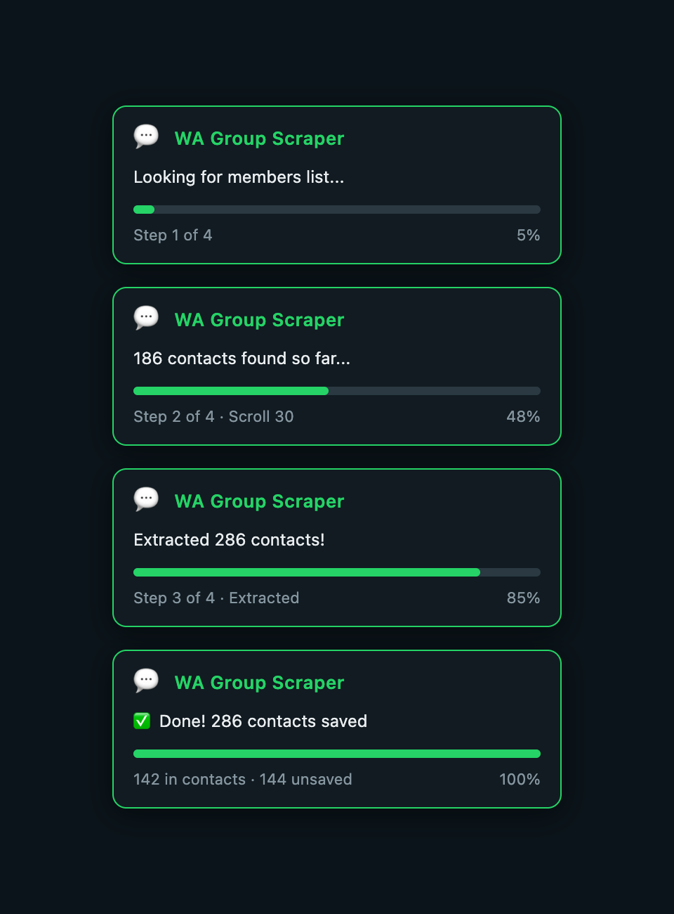

<p align="center">
  <a href="https://www.situmorang.com">
    
    
  </a>
</p>  
<h1 align="center">Whatsapp-Group-Contacts-Scraper 👋</h1>
<p>
  
  
  
  
  
  
  <a href="https://twitter.com/edmund7s" target="_blank">
    
  </a>
  <a href="https://discord.gg/NvP5FW7 target="_blank">
    
  </a>
</p>

How to scrap whatsapp group contacts from https://web.whatsapp.com/
This will enable you to get group contacts from your whatsapp specific group you chose as a list on csv or excel

### 👯Clone Project
```shell
git clone https://github.com/situmorang-com/Whatsapp-Group-Contacts-Scraper.git
```
### 🍴Fork Project
You can fork this project by clicking `fork button` 👉  the top right corner of this page.


## 📸 Progress Banner

While the script runs, a live progress banner appears in the top-left corner of your browser showing real-time status and a progress bar:

<p align="center">
  
</p>

## 🚀How to use it?
1. Open your `"Whatsapp Web"` from a browser: "https://web.whatsapp.com/"
2. Select a `Whatsapp Group`
3. Click the **group name** in the chat header to open the **Group Info** panel
4. Click **"View all"** or the **member count** to open the full members list modal
5. Press `F12` or `Ctrl-Shift-I`(Windows) / `Cmd-Shift-I`(Mac) to open the browser console
6. Paste the whole code from `WA Group Contact Scraper.js` and press `ENTER`
7. The script will **auto-scroll** through all members, extract data, and download a `.csv` file

> **Note:** The script needs the full members modal to be open (not just the side panel). Look for the popup/dialog that shows all group members.

Now you can open your file and find your list of contacts which specifies the following:
The header will tell you the group name and number of contacts that it has in that group
- **Column A - num**: phone number of the contact (or "N/A" if not available)
- **Column B - namenum**: phone number as shown, or "IN_CONTACTS" if already saved in your phone
- **Column C - name**: display name of the contact
- **Column D - img**: link to the contact's profile picture (or "No Pic")
- **Column E - status**: current status/bio of the contact (or "NONE")

## 🔄 What changed in v2.0?
- **Stable selectors**: Uses `role="listitem"`, `role="dialog"`, `data-animate-modal-body`, `span[title][aria-label]` instead of fragile DOM traversal chains
- **Virtual scroll support**: WhatsApp Web only renders visible members — the script now auto-scrolls to load and capture ALL members
- **Multiple fallback strategies**: 3 different methods to find the member panel, so it works across WhatsApp Web updates
- **async/await**: Proper asynchronous flow instead of fixed timeouts
- **Better CSV**: Proper escaping, BOM for Excel compatibility, cleaner output
- **Progress logging**: See live extraction progress in the console

If this project has helped you please give me a "STAR" up above and help spread the news.

Thanks.


### 🏠 [Homepage](https://situmorang.com)

### ✨ [Demo](https://web.whatsapp.com)

## Author
👤 **Edmund Situmorang**

## ❤️&nbsp; Community and Contributions
<a href="https://github.com/situmorang-com/Whatsapp-Group-Contacts-Scraper/graphs/contributors">
  
</a>

We are open for contributors. Whether you are helping us fixing bugs, proposing new feature, improving our documentation or spreading the word - **we would love to have you as part of the our community**.


## 👍 Show your support
Give a ⭐️ if this project helped you! 

## 📫&nbsp; Have a question? Want to chat? Ran into a problem?
We are happy to welcome you in our official (🔗click here)👉 [](https://discord.gg/NvP5FW7) Or **reach out to us directly** via [](https://twitter.com/edmund7s)
